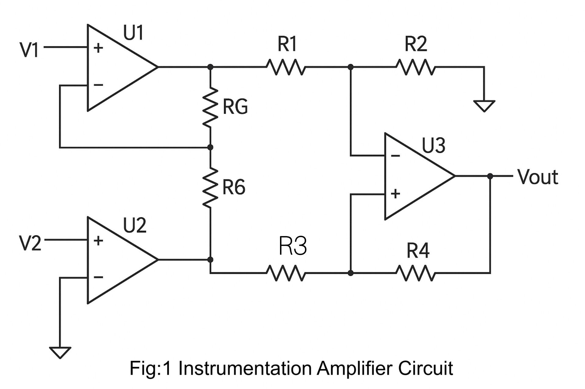
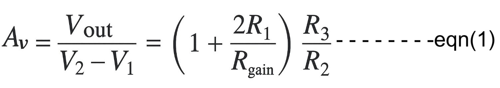
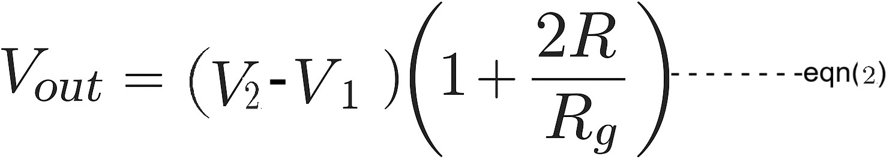
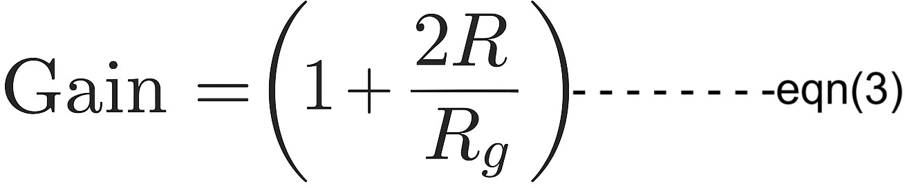
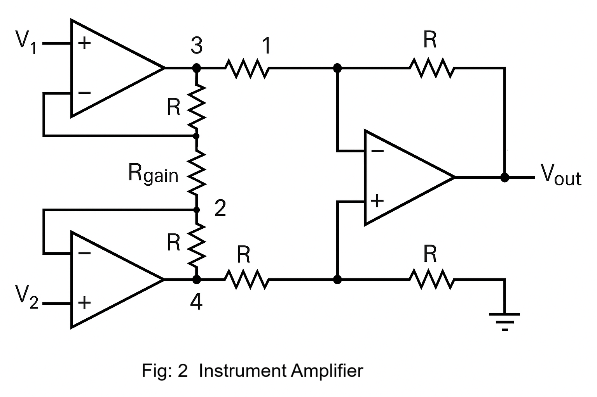
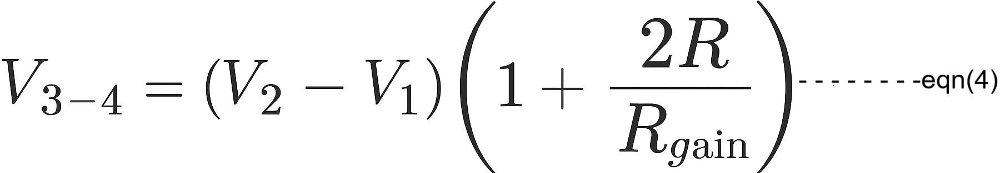

<h3>Introduction:</h3>
An instrumentation amplifier is more than just an integrated circuit (IC); it is a precision amplifier designed to provide high differential gain and excellent common-mode rejection.  
Belonging to the family of differential amplifiers, it amplifies the voltage difference between two input signals while rejecting signals that are common to both.
This makes instrumentation amplifiers especially valuable in minimizing unwanted noise picked up by circuits. 
The effectiveness of this noise rejection is measured by a parameter called the Common-Mode Rejection Ratio (CMRR). 
Due to their high CMRR, instrumentation amplifiers are widely used in applications requiring accurate and low-noise signal amplification. 
 Other characteristics, such as :  

- Loop Gain: The gain within the feedback loop of the amplifier, which affects accuracy, stability, and rejection of common-mode signals. High loop gain helps maintain precise amplification.   

- Low DC Offset: ensures that the amplifier does not introduce unwanted DC voltage at the output, which is critical for accurate low-level signal measurements.   

- Low Drift: refers to minimal variation in amplifier performance due to temperature changes or time, ensuring reliable and consistent signal amplification in precision applications. make this IC very important in circuit design.

  

The most commonly used instrumentation amplifier circuit is shown in fig 1. 
The gain of the circuit is given as:  
Av = (1 + (2R₁ / RG)) × (R₃ / R₂)  
Where:

R₁ is the resistor connected in series with the input stage op-amps.

RG is the resistor between the input stage op-amps and is used to set the overall gain.

R₂ and R₃ are the resistors in the differential amplifier stage (third op-amp).

The first term (1 + 2R₁ / RG) represents the gain from the input buffer stage.

The second term (R₃ / R₂) represents the gain from the differential stage.

<!--

  

-->
An instrumentation amplifier is a differential op-amp circuit that offers high input impedance and allows for easy gain adjustment by varying a single resistor.
It is essentially a differential amplifier enhanced with input buffer stages, which eliminate the need for impedance matching at the inputs. This makes instrumentation amplifiers especially well-suited for measurement and test equipment.

Additional key characteristics include:

Very low DC offset

Low drift and low noise

Very high open-loop gain

Excellent common-mode rejection ratio (CMRR)

Very high input impedance

The input of an instrumentation amplifier typically receives signals from transducers, which usually output very small voltage levels. Because of this, the amplifier must maintain accuracy and stability over both short- and long-term periods.

Instrumentation amplifiers are commonly used in applications where precision, stability, and noise rejection are critical.

The output voltage (Vout) of the instrumentation amplifier can be calculated using the following formula:

Vout = Av × (V2 − V1)

Where:

V1 and V2 are the two input voltages.

Av is the voltage gain of the amplifier.

 
<!--

  

-->
<!--Where, (V2-V1) = Voltage difference of the input voltages 
 R = Resistor value the circuit  
Rg  = Gain Resistor  
So the value of R and Rg decides the gain of the amplifier.
 The value of gain can be calculated by using eqn(3) : 

  

 --> 
The gain of the input stage of the instrumentation amplifier is given by:

Av = 1 + (2R / RG)

Where:

R is the resistance connected between each input op-amp and the shared resistor.

RG is the resistor between the two input op-amps that sets the gain.

This equation shows that the gain can be increased by decreasing the value of RG, making the amplifier suitable for various signal amplification needs.

The amplifier’s gain is referred to as the factor by which the amplifier amplifies the input signal.  The resistance values represent the gain of an instrumentation amplifier.  The gain also depends on the type of feedbacks being used. The positive feedback provides higher gain, whereas negative feedback provides better stabilities of the system.
<h2>Understanding the Instrumentation Amplifier Circuit</h2>

<h3>Instrumentation Amplifier Design</h3>
An instrumentation amplifier is a combination of 3 typical amplifiers.  They are connected in a specific order to build an instrumentation amplifier.  We can segregate the instrument amplifier design into two-part. 
The first part is “Two input and two output”.  Two standard operational amplifiers are connected, as shown in the amplifier circuit figure.  Both of them are provided with negative feedback as it stabilizes the circuit more.  The output of both the amplifier is connected with three resistors. 
The second part is a basic “Differential Amplifier”.   The output of both the previous amplifier acts as input for the last amplifier.  Outputs are connected with two identical valued resistors with the amplifier.  
The positive section is grounded, and negative feedback is associated with the negative terminal and the o/p of this op-amp  is the final output of the instrument amplifier.
This intimidating circuit is constructed from a buffered differential amplifier stage with three new resistors linking the two buffer circuits together as shown in fig:2.    

  

Consider all resistors to be of equal value except for Rgain. The negative feedback of the upper-left op-amp causes the voltage at point 1 (top of Rgain) to be equal to V1.  Likewise, the voltage at point 2 (bottom of Rgain) is held to a value equal to V2.  This establishes a voltage drop across Rgain equal to the voltage difference between V1 and V2.  That voltage drop causes a current through Rgain, and since the feedback loops of the two input op-amps draw no current, that same amount of current through Rgain must be going through the two “R” resistors above and below it. This produces a voltage drop between points 3 and 4 equal to:

  

The regular differential amplifier on the right-hand side of the circuit then takes this voltage drop between points 3 and 4 and amplifies it by a gain of 1 (assuming again that all “R” resistors are of equal value) 
<h3>Instrumentation Amplifier Characteristics</h3>
Let us look at the characteristics of the instrumentation amplifiers at a glance: 
•	Instrumentation Amplifiers are Differential Amplifiers made up of three op-amps. 
•	It provides a higher open-loop gain than typical op-amps. 
•	It has higher CMRR, higher input impedance, low offset voltages, lower output impedances, making it close to the ideal op-amp. 
•	Instrumentation amplifiers provide higher accuracy and precision when used in testing and measuring. 
•	Instrumentation amplifiers are available in ICs for commercial purposes. 

